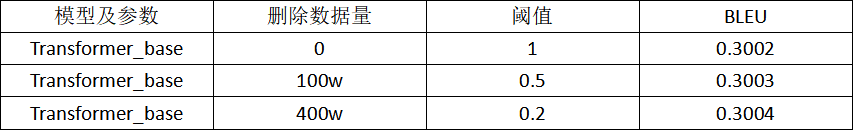
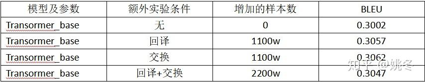
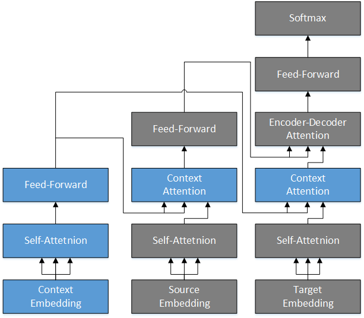
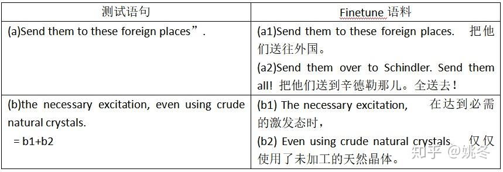
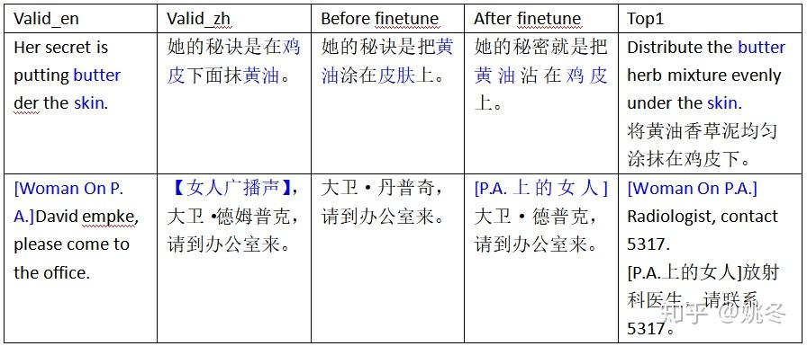
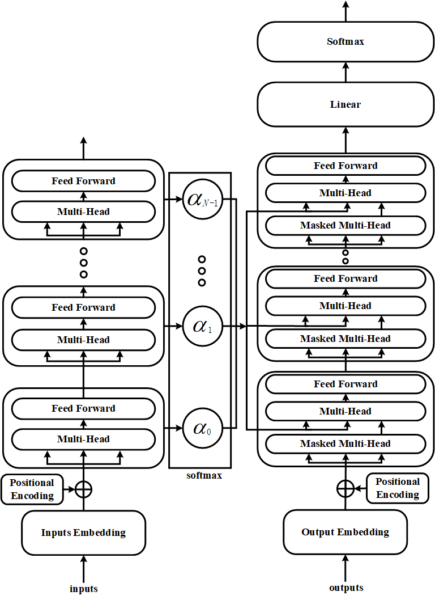
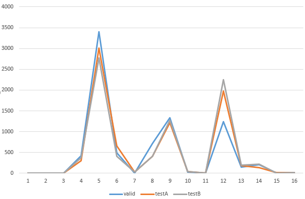
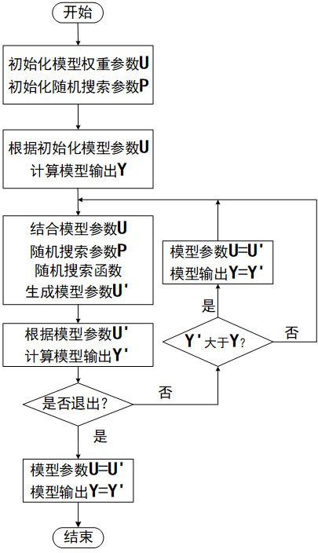

金山集团AI Lab组队参加了 [AI Challenger 2018](https://zhida.zhihu.com/search?content_id=100142208&content_type=Article&match_order=1&q=AI+Challenger+2018&zhida_source=entity) 全球挑战赛的英中机器翻译项目，并且获得冠军。

AI Challenger 2018主题为"用AI挑战真实世界的问题"，是目前国内规模最大的科研数据集平台、最大非商业化竞赛平台，最关注前沿科研与产业实践相结合的数据集和竞赛平台，也是2018年度中国超高水准的AI竞赛。本次比赛使用的数据总量达到1300万句对，其中具有上下文情景的中英双语数据达到300万句对，相比去年大幅扩容。

在此，参赛团队就技术和经验做一些分享，希望对大家有帮助。  

**0\. 工具介绍**

机器翻译的开源库很多，比如[OpenNMT](https://zhida.zhihu.com/search?content_id=100142208&content_type=Article&match_order=1&q=OpenNMT&zhida_source=entity)、[FairSeq](https://zhida.zhihu.com/search?content_id=100142208&content_type=Article&match_order=1&q=FairSeq&zhida_source=entity)和[tensor2tensor](https://zhida.zhihu.com/search?content_id=100142208&content_type=Article&match_order=1&q=tensor2tensor&zhida_source=entity)等，我们主要是基于tensor2tensor等工具库进行的程序实现。它是google基于TensorFlow开发的高级库，内置了许多经典模型，开发调试比较方便。

我们使用了3台V100 GPU服务器及1台32核的CPU服务器作为主要的实验设备。

我们选用Transformer模型作为我们的baseline模型。

**1\. 数据清洗**

优质的数据不管在哪个领域下都是有益的。对于一个任务来说，我们首先要进行的就是数据的分析及清洗。数据清洗的一个通常操作就是去除重复数据，原始语料中存在着6.56%的重复，共约90w个样本，对这些样本我们进行了去重操作，一般直接删去即可。

另外我们对源句子与目标句子长度比例进行了检测，当长度比超过一定的阈值时我们就将对应的平行语句对进行删除。

同时我们还注意到有一部分语料存在着对齐错误，对此我们使用了[giza++](https://zhida.zhihu.com/search?content_id=100142208&content_type=Article&match_order=1&q=giza%2B%2B&zhida_source=entity)对训练数据进行了对齐并获得一份双语词典。使用获得的双语词典我们就可以对平行语料进行漏翻检测，通常我们会对语料的漏翻程度进行打分，分值超过一定阈值时，我们就会删除对应的语料。

下表可以看到，分值越低，删除的语料越多，结果有了些许提升。

**2\. 数据增广**

在本次比赛中，我们使用了两种数据增广手段，分别是回译和交换。

NMT中用回译的方法扩充语料是常用的数据增广技术，见Facebook在WMT18英译德的冠军论文《Understanding Back-Translation at Scale》。在该论文中，仅依靠回译生成的语料做数据增广就能将BLEU提高1至2个点。

在回译时，我们基于现有语料训练了一个从目标语言到源语言（中翻英）的翻译模型。将目标语言语料输入该模型就能获得对应的源语言语料，将二者结合后就得到了新的平行语料。当然，在facebook的论文中，他们使用了226M的单语语料去生成数据。本次比赛不允许使用外部数据，所以我们直接使用原始预料中的中文部分进行生成。但是，这种方法会存在一个问题，就是新的平行语料与原始语料可能存在重复。针对这个问题，我们在解码端加入了一定的随机噪声，从而避免了这种情况。

我们还使用了交换的方法，将原始语料中的英文语料的相邻的词都交换了一遍。其实，把交换作为数据增广的手段有些牵强。交换的实际目的是为了增强模型的抗噪能力，但是我们还是通过交换语料的语序扩充了实验数据，所以把它算作数据增广的一种手段。

从表格中可以看到两种方法单独使用时都有了一定的提升，说明数据增广技术还是有一定效果的。

但是需要注意的就是两种方法同时使用时效果会有一些下降。

**3\. 模型改进**

获得语料后，我们就开始尝试在模型层面进行一些改进。

在分词实验时，我们共使用了三种分词方法，分别是tensor2tensor中默认的分词方式，还有基于character级别的分词和使用SentencePiece的分词，后两种分词方法较第一种均有1个bleu值的提升。

我们还使用了relative transformer，这个模型在transformer\_big参数条件下提升了0.3个bleu值。模型细节详见《Self-Attention with Relative Position Representations》。

基于transformer，我们提出了一种新的模型结构，叫做layer-attention。

**模型结构图**：

该模型，在transformer\_big参数下，在newstest2014\_ende上面提升了0.9个bleu值。上图为原始的transformer，从图中我们可以看到transformer是将encoder端最后一层的信息直接输出给decoder端。而我们的改进，是将encoder端所有层的输出进行了加权求和，然后将求和后得到的结果输入到decoder端中。因为时间原因，我们并没有在本次比赛的测试集数据上单独测试该模型的效果，而是将其使用在了最后的rerank中。

另外，在本次比赛给出的数据集中，约有300w的语料包含上下文信息，为了使用这些信息，我们使用了一种可以将上下文信息引入的模型叫做[contextual trasformer](https://zhida.zhihu.com/search?content_id=100142208&content_type=Article&match_order=1&q=contextual+trasformer&zhida_source=entity)，模型结构见下图。具体细节及实验设置见论文《[Improving the Transformer Translation Model with Document-Level Context](https://link.zhihu.com/?target=https%3A//arxiv.org/pdf/1810.03581v1.pdf%2522%2520%255Ct%2520%2522https%3A//zhuanlan.zhihu.com/p/_blank)》。该模型在transformer\_base条件下有了0.5个bleu的提升。

Contextual Transformer就是在原始transformer的基础上引入了额外的context encoder，并且在transformer 的 encoder 和 decoder端加入了 Context Attention层。

这种结构增加了模型捕捉上下文信息的能力，并且因为依旧使用的multihead并行计算，所以训练和解码速度并没有下降很多。

**4\. Finetune**

finetune就是使用少量的语料进行预训练模型的微调。如果使用过预训练的语言模型（如[ELMo](https://zhida.zhihu.com/search?content_id=100142208&content_type=Article&match_order=1&q=ELMo&zhida_source=entity)，[GPT](https://zhida.zhihu.com/search?content_id=100142208&content_type=Article&match_order=1&q=GPT&zhida_source=entity)或[BERT](https://zhida.zhihu.com/search?content_id=100142208&content_type=Article&match_order=1&q=BERT&zhida_source=entity)），那么对于finetune就不会陌生。本次比赛中，我们使用与测试语句相似的句子作为finetune语料，在现有模型基础上进行微调。

我们对测试语料与训练语料进行了相似度打分并排序，从中选取出了与每句测试语句相似度最高的训练语料作为最终的finetune语料。从表格的第一行我们可以看到，测试语句中Send them to these foreign places”与微调语料a1只有最后的符号不同。而第二行中的测试语句the necessary excitation, even using crude natural crystals.为两个微调语料b1和b2的结合。

经过这样的fineune训练后，我们的模型对于测试集的数据势必有所倾向。finetune后的翻译表现也验证了我们的猜想。

从表格中第一行可以发现，Her secret is putting butter under the skin.这句话的正确意思是她的秘诀是在鸡皮下面抹黄油。但是在微调前，我们得到的释义是她的秘诀是把黄油涂在皮肤上。而在finetune后我们得到了正确的释义把黄油粘在鸡皮上。这也说明finetune可以帮助我们获得了一些词在某些语境下的正确释义。

而第二行中，方括号内的语句\[ Woman On P. A.\]，在finetune前并没有被翻译，但是经过finetune后可以看到我们获得了该句的翻译，\[P.A.上的女人\] ，可见finetune也可以帮助我们降低漏翻的概率。

**5\. Rerank**

通过前面介绍的不同方法和尝试，我们获得了很多不同的模型。这些模型有的训练数据集不同，有的分词方式不同，有的模型结构不同，有的还进行了finetune。我们将这些模型都做保留，目的就是为了保持不同模型的差异性，用于进行后续的rerank实验。

在我们得到的所有结果中，他们的分值表现各不相同，但是势必会存在这样一种情况，BLEU值较高的结果文件中也会出现翻译不好的语句，而BLEU值较低的文件中同样也会出现翻译比较好的语句。

我们的目标就是将尽可能多的的翻译较好的语句筛选出来，组成最终的结果。为此我们进行了一些尝试。

我们将解码时返回的beam\_score作为排序分值依据，但是不同的模型有不同的表现，所以就很难在统一的度量下进行排序。所以针对不同的模型我们引入了不同的权重。使用beam\_score×weight 作为每个翻译结果的最终分值，通过筛选获得了最终的结果。

因此，如何去获得准确的权重成为了一个问题。我们首先通过人工调整尝试性地给出了一份权重值，但是显然，对于16个模型来说，仅依靠人工调参无法遍历整个权重参数搜索空间。于是我们想到了贝叶斯调参。我们使用贝叶斯调参搜索出了一些权重参数，但是相较我们手动调整的参数提升并不是很大。

于是我们提出了一种新的随机参数搜索方案，如下图所示。我们首先给出权重参数U和随机搜索参数P，然后使用U获得了结果文件Y。基于U和P通过随机搜索函数获得了新的参数U’，基于U’获得了新的结果文件Y’，比较Y和Y’的分值情况，我们选择保留最好结果所对应的权重参数。

我们最后选用在验证集上表现最好的参数，使用在了测试集上。

下图为最终的结果从各个模型中抽取的数量分布，从图中可以看到valid，testA，testB抽取的分布是大致一样的，这也证明了我们rerank方法是稳定且有效的。

从图中我们还发现主要从3个模型中进行了抽取，分别是基于Character级别的，基于context，基于SentencePiece和finetune的。

从抽取分布图可以看出，从finetune的模型中抽取的数据并没有想象的那么多，对此我们进行了另外的尝试。我们利用投票机制，首先使用finetune的模型进行投票，将finetune模型中大部分相同的语句直接抽取出来作为最终的结果，剩余的结果依旧使用随机参数搜索方案进行抽取。

此外除却上面的beam\_score \* weights方案，我们还尝试使用语言模型对翻译的句子进行打分，然后选取分值最高的句子。但是该方法效果略差于前两者，所以最终我们选择使用第一种方案，即按照beam\_score \* weights作为最终的排序依据。

金山集团AI Lab组建只有不到两年，是一只年轻的队伍，我们会持续在机器翻译等领域深入研究，希望对AI业界有所贡献。